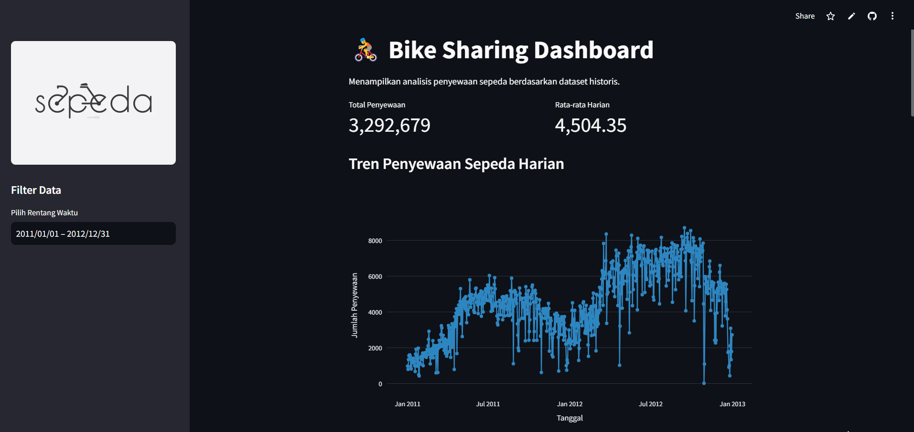

# Dashboard Sewa Sepeda"

## Preview



## Deskripsi
Proyek ini dirancang untuk menganalisis data dari Bike Sharing Dataset dengan tujuan menghasilkan wawasan serta informasi berharga berdasarkan hasil analisis data.

## Instalasi

1. Clone repository ini ke komputer lokal Anda menggunakan perintah berikut:

   ```shell
   git clone https://github.com/millkywaay/submission-proyek-akhir-analisis-data.git
   ```

2. Pastikan Anda memiliki lingkungan Python yang sesuai dan pustaka-pustaka yang diperlukan. Anda dapat menginstal pustaka-pustaka tersebut dengan menjalankan perintah berikut:

    ```shell
    pip install -r requirements.txt
    ```

## Penggunaan
1. Masuk ke direktori proyek (Local):

    ```shell
    cd submission-proyek-akhir-analisis-data/dashboard/
    streamlit run dashboard.py
    ```

---
**© 2025 Khoirunnisa - Bike Sharing Analytics Dashboard**

